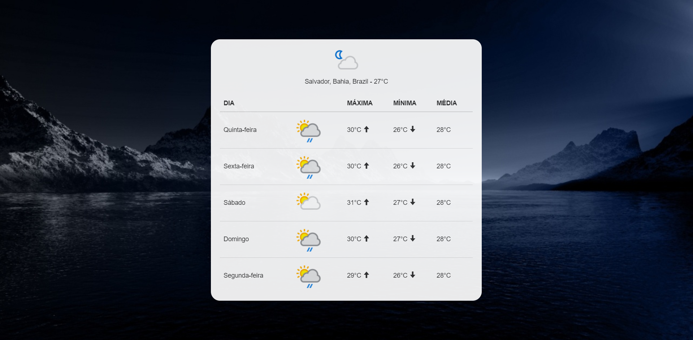

# LocalWeather-App

Disponível em: [LocalWheater](https://hspacheco.github.io/LocalWeather-App/)

## Desafio Convergence Works

Weather API disponível em - [Apixu](https://www.apixu.com/)

* Exibição da condição climática atual + temperatura (°C).
* Máxima, mínima e média do dia atual e dos próximos 4 dias.
* Ícone para demonstrar nível de precipitação / condição do clima.
* Background muda caso dia ou noite.
* As informações são dadas conforme localização.

## Preview

